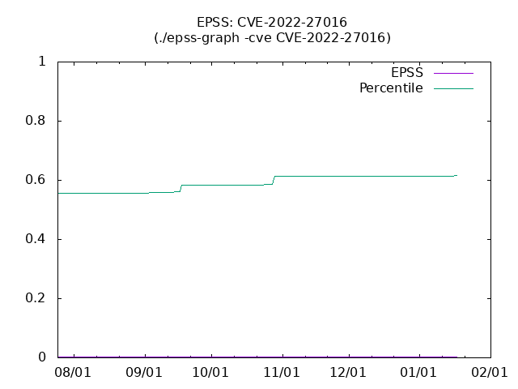
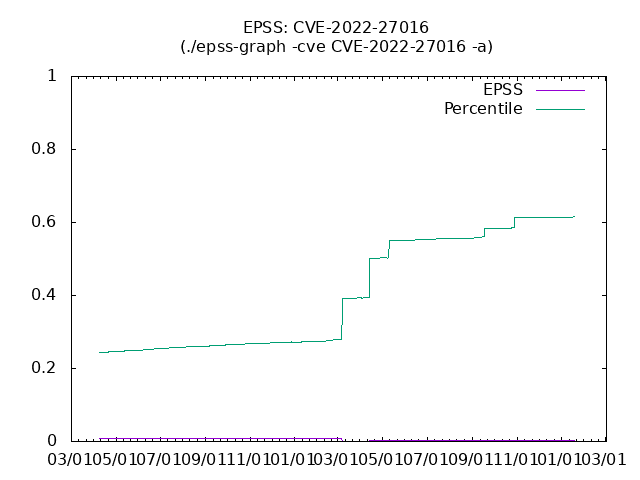

# epss-db
Download all epss data, and import database. We can explore the data by SQL querys!

**NOW: THIS IS AN EXPERIMENTAL IMPLEMENTATION.**

- Sehll script verison.
- Work on mysql docker image.

README.md was created using Google Translate.

Supported data
- epss
- KEV Catalog
- Vulnrichment

# What's NEW!

- 2024-05-23 JST
  - Experimental suport: Vulnrichment data!
    - Please refer to the following for details.
    - https://github.com/hogehuga/richmentdb
- 2024-05-02 JST
  - CISA Known Exploited Vulnerabilities Catalog(a.k.a KEV Catalog) is comming!
    - epssdb/kevcatalog table available.
- 2024-01-21 JST
  - epss-graph.sh is comming! Plot EPSS/Percentile graph by CVE-ID.
- 2024-01-20 JST
  - It has been redesigned to be simpler!
    - remove sqlite3 version, because toooooo slow(access single 40GB file)
    - I decided to use a Docker image
- 2023-12-10 JST
  - Added epss-add.sh to add data.
- 2023-12-04 JST
  - First release.

# Wht's This?

EPSS is Exploit Prediction Scoreing Syste from FIRST ( https://www.first.org/epss/ ).

I want to analyze EPSS, but I don't need to use SIEM, so I wanted something that could be analyzed using SQL.
We thought it was important to first implement something simple and have it widely used.

And The KEV catalog is now also included in the database. I think the range of use will be further expanded by combining it with EPSS's cveID.

An environment where Docker can be executed is required.

# System configuration

## REQUIRE

- docker
- HOST disc space
  - EPSS .csv.gz file  : 1[GB]
  - EPSS mysql database: 40[GB]
- Ability to write SQL statements ...

## File and Directory


```
/opt/epss-db
|-- Documents
|   |-- epss-graph.png
|   `-- epss-graph_-a.png
|-- LICENSE
|-- README.md
|-- docker
|   |-- Dockerfile
|   |-- README.md
|   `-- env
|-- epss-graph.sh
|-- init-script
|   |-- epss-init.sh
|   |-- kev-init.sh
|   `-- vulnrichment-init.sh
|-- my.cnf
|-- queryConsole.sh
|-- skel
|   `-- plot.plt
|-- subprogram
|   |-- epss-add.sh
|   `-- vulnrichUpdate.sh
|-- update-all.sh
|-- update-epss.sh
|-- update-kev.sh
`-- update-vulnrich.sh
```

- epss-graph.sh
  - Once you pass your CVE-ID, a graph will show you your EPSS and percentile changes over the past 180 days.
- epss-data
  - The contents differ depending on when the data was provided, so we save it separately in 1st/2nd/3rd directories.
  - Download EPSS .gz data.
  - and store MySQL Load file.
- init-script/
  - The first script to run when using EPSS, KEV Catalog, Vulnrichment.
- my.cnf
  - Settings for accessing the mysql console.
- queryConsole.sh
  - This is a script to easily open the mysql console.
- skel
  - skelton(template) file directory.
- subprogram
  - epss-add.sh
    - This is a script that downloads data for a specific day and registers it in the database.
  - vulnrichUpdate.sh
- update-all.sh
  - alias for execute all update script(update-epss/kev/vunrich)
- update-epss.sh
  - Update EPSS database.
- update-kev.sh
  - Update KEV Catalog database.
- update-vulnrich.sh
  - Update Vulnrichment database.


# How to use this.

## setup EPSS database

Get Dockaer image

```
$ docker pull hogehuga/epss-db
```

Create docker volume
- mysql database data: `epssDB` volme
- epss .csv.gz file: `epssFile` volume

```
$ docker volume create epssDB
$ docker volume create epssFile
```

Run container
- If you want to share the "share" directory for sharing analysis results, please add `-v <yourShredDirctory>:/opt/epss-db/share`.
  - eg. container:/opt/epss-db/share , host sahred:/home/hogehuga/share. -> `-v /home/hogehuga/share:/opt/epss-db/share`
```
$ docker container run --name epssdb -v epssDB:/var/lib/mysql -v epssFile:/opt/epss-db/epss-data -e MYSQL_ROOT_PASSWORD=mysql -d hogehuga/epss-db
```

Prepare the data
```
$ docker exec -it epssdb /bin/bash
(work inside a container)
# cd /opt/epss-db/init-script
# ./epss-init.sh
```

Once your data is ready, all you need to do is use it!


### optional: KEV Catalog

run EPSS container.

Init for The KEV Catalog database.
```
$ docker exec -it epssdb /bin/bash
(work inside a container)
# cd /opt/epss-db/init-script
# ./kev-init.sh
```

### experimental: Vunlrichment

run EPSS container

Init for The Vulnrichment database
```
$ docker exec -it epssdb /bin/bash
(work inside a container)
# cd /opt/epss-db/init-script
# ./vulnrichment-init.sh

```


## Data analysis: EPSS

Enter the container and use SQL commands to perform analysis.

```
$ docker exec -it epssdb /bin/bash
(work inside a container)
# cd /opt/epss-db
# ./epssquery.sh
mysql> select * from epssdb limit 1;
+----+---------------+---------+------------+-------+------------+
| id | cve           | epss    | percentile | model | date       |
+----+---------------+---------+------------+-------+------------+
|  1 | CVE-2020-5902 | 0.65117 |       NULL | NULL  | 2021-04-14 |
+----+---------------+---------+------------+-------+------------+
1 row in set (0.00 sec)

mysql>
```

## epss-graph.sh

Create EPSS and percentile charts and CSV data for the past 180 days.
- Using the `-a` option will create the graph using all the data present in the database.
- Data will be created under ./shera directory
  - <CVE-ID>.csv: CSV data
  - EPSS-<CVE-ID>.png: Graph
  - skel-<CVE-ID>.plt: gnuplot script. Template is `./skel/plot.plt`

If you want to change gnuplot options, edit the skel-<CVE-ID>.plt file.
- edit skel-<CVE-ID>.plt file
  - tile, tics, label, etc...
- Pass skel to gnuplot and draw the graph.
  - `# LANG=C.utf8 gnuplot skel-<CVE-ID>.plt`

```
# ./epss-graph.sh -cve "CVE-2022-27016"
; -> ./share/CVE-2022-27016.csv (from:180 days ago)
; -> ./share/EPSS-CVE-2022-27016.png

# ./epss-graph.sh -cve "CVE-2022-27016" -a
; -> Similar to above, but creates images for all registered periods

```




## Update EPSS data

Automatically registers data from the last registered data to the latest data in the database.

```
# ./epss-autoAdd.sh
```

## Update epss-db

`git pull origin` or rebuild container.

```
# cd /opt/epss-db
# git pull origin
```

```
on HOST

$ docker stop epssdb
$ docker pull hogehuga/epss-db
$ docker container run --name epssdbNEWNAME -v epssDB:/var/lib/mysql -v epssFile:/opt/epss-db/epss-data -e MYSQL_ROOT_PASSWORD=mysql -d hogehuga/epss-db
  ; Please specify the same value as last time

NOTE:
- Databases(/var/lib/mysql as "epssDB" docker volume) and files(/opt/epss-db/epss-data as "epssFile" docker volume) will be inherited.
```

## Optional: KEV Catalog search

At the moment, we are using SQL.

```
$ docker exec -it epssdb /bin/bash
(work inside a container)
# cd /opt/epss-db
# ./epssquery.sh
mysql> select YEAR(dateAdded) as year, count(dateAdded) as count from kevcatalog group by year ;
+------+-------+
| year | count |
+------+-------+
| 2021 |   311 |
| 2022 |   555 |
| 2023 |   187 |
| 2024 |    51 |
+------+-------+
4 rows in set (0.00 sec)

mysql> select epssdb.cve, epssdb.epss, epssdb.percentile, kevcatalog.dateAdded, kevcatalog.vendorProject, kevcatalog.knownRansomwareCampaignUse from epssdb INNER JOIN kevcatalog ON epssdb.cve = kevcatalog.cveID where epssdb.cve="CVE-2021-44529" and epssdb.date="2024-04-20";
+----------------+---------+------------+------------+---------------+----------------------------+
| cve            | epss    | percentile | dateAdded  | vendorProject | knownRansomwareCampaignUse |
+----------------+---------+------------+------------+---------------+----------------------------+
| CVE-2021-44529 | 0.97068 |    0.99757 | 2024-03-25 | Ivanti        | Unknown                    |
+----------------+---------+------------+------------+---------------+----------------------------+
1 row in set (0.09 sec)

mysql>
```

## Optional: KEV Catalog update

Unlike CVSS etc., it does not provide differences, so please delete the database and re-register it.

```
# cd /opt/epss-db
# ./kev-refresh.sh
CVE-nnnn-nnnn
...
#
```

- As of May 2024, it takes about 1 minute and 30 seconds to complete in my environment.


## Experimental: Vulnrichment search

```
mysql> select adpSSVCAutomatable, count(*) from summary group by adpSSVCAutomatable;
+--------------------+----------+
| adpSSVCAutomatable | count(*) |
+--------------------+----------+
| no                 |     2653 |
| Yes                |      558 |
|                    |       41 |
+--------------------+----------+
3 rows in set (0.01 sec)

mysql>
```

## Experimental: Vulnrichment update

Since the data update status is unknown, please delete all data and register again.

```
# /opt/epss-db/update-vulnrich.sh
```

## Experimental: Vulnrichment remove

1. remove from database

```
# /opt/epss-db/queryConsole.sh
> drop table richment;
```

2. remove local repositories file

```
# rm -rf /opt/epss-db/ulnrichment
```


# technical note

## EPSS data

| Field      | Type        |
|:-----------|:------------|
| id         | int         |
| cve        | varchar(20) |
| epss       | double      |
| percentile | double      |
| model      | varchar(20) |
| date       | date        |

## KEV Catalog data

https://www.cisa.gov/known-exploited-vulnerabilities-catalog
- Schema is https://www.cisa.gov/sites/default/files/feeds/known_exploited_vulnerabilities_schema.json

|field                     |original json type|note                      |mysql Table  |
|:-------------------------|:-----------------|:-------------------------|-------------|
|id                        |(not exist)       |(for RDBMS)               |int, not Null|
|cveID                     |string            |^CVE-[0-9]{4}-[0-9]{4,19}$|varchar(20)  |
|vendorProject             |string            |                          |text         |
|product                   |string            |                          |text         |
|vulnerabilityName         |string            |                          |text         |
|dateAdded                 |string            |format: YYYY-MM-DD        |date         |
|shortDescription          |string            |                          |text         |
|requiredAction            |string            |                          |text         |
|dueDate                   |string            |format: YYYY-MM-DD        |date         |
|knownRansomwareCampaignUse|string            |(Known or Unknown only?)  |text         |
|notes                     |string            |                          |text         |
